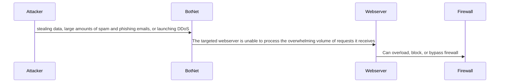

Step 1 - The attacker sends the BotNets to coordinate and execute a highly distributed and scalable attack against
a target, sends massive amounts of traffic that is hard to block and trace.
Step 2 - Botnets amplify the scale and effectiveness of a DDoS attack by leveraging many devices, making it harder 
for the webserver to defend against the sheer volume of incoming traffic.
Step 3 - During the attack the firewall can become overwhelmed by the volume of traffic, strugle to filter them and 
fail to enforce security  measures it normally would such as traffic filtering, IP blacklisting and blocking,
connection limiting and deep packet inspection.
